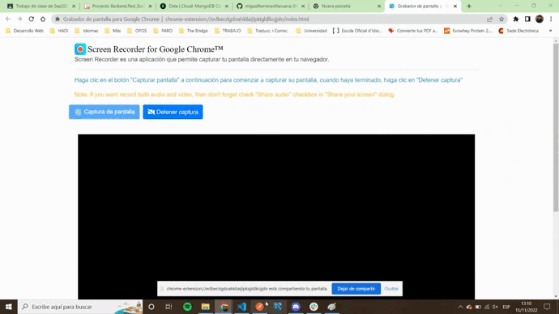
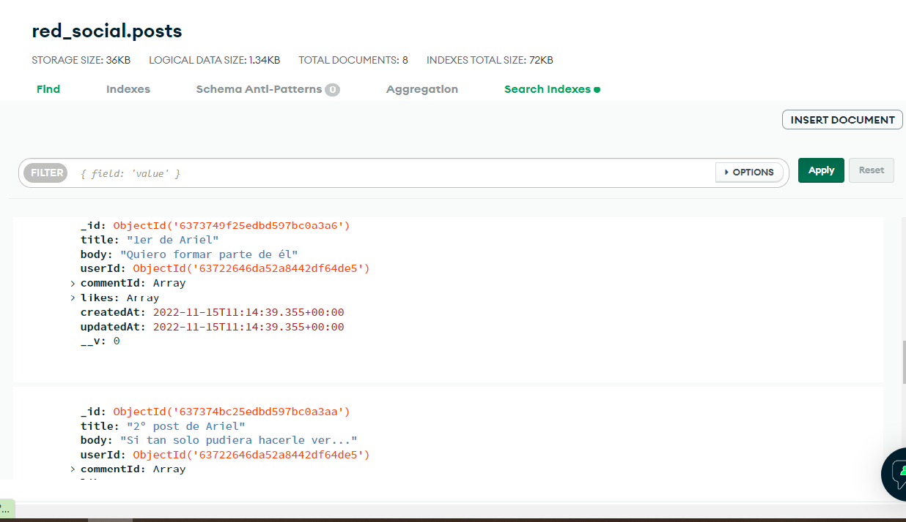

# Backend 2nd Project - Social Network

The following project consists on the creation of a social network in which the knowledge acquired in Node and Express technologies is combined, in addition to MongoDB Cloud and Mongoose.

## Description and development of the project 🔧

For this project it has been needed to develop an REST API capable of the following points:

- User registration using Bcrypt.
- User login + token + middleware.
- Creation of a CRUD.
- Give/remove "Like" at a post.
- Backend available in production.

Also, one of the essential requirements of the project has been the use of branches on Git (personal, develop and main).

## Technologies used 💻

For this project I have used Node, Express, MongoDB Cloud and Mongoose technologies, and the Postman API platform.
Also, I have used Trello tool to keep an organization of the project.

### Preview 

- Postman general overview
    User Get Info User & Get Post By Title endpoint.

- MongoDB Cloud Posts overview

----

Developed by [Miguel Herrera](https://github.com/miguelherreravillanueva)
